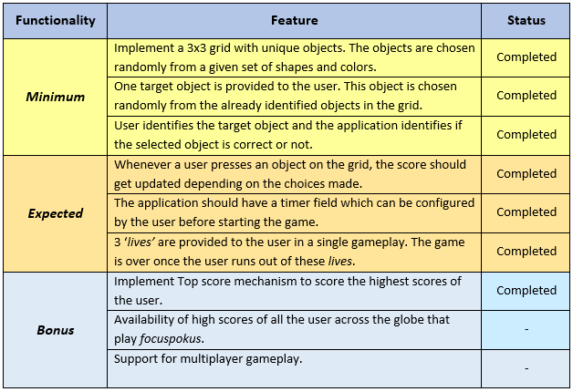
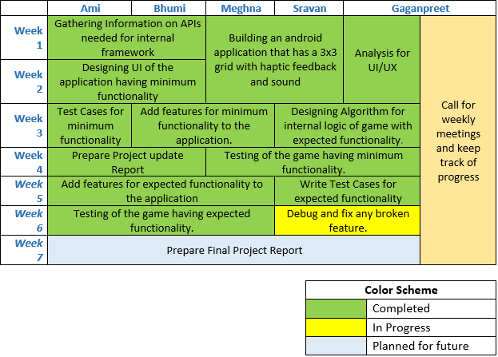

# **FocusPokus**
**FocusPokus**, the Android application we developed as a part of the Mobile Computing project-work, is a minimalistic yet captivating game that aims at inculcating cognitive skills.

<br />

## Team TechGoons
|**Name**|**BannerID** |
|--|--|
| *Ami Trivedi* | B00828817 |
| *Bhumi Patel* | B00824756 |
| *Sravan Sajeev* | B00825856 |
| *Meghna Ramachandra Holla* | B00812604  |
| *Gaganpreet Singh* | B00819217|

<br />

## GitLab
[Click here](https://git.cs.dal.ca/singh1/focuspokus.git) to go to GitLab Repository.<br />
***Note:*** Drop a mail to [Gaganpreet Singh](gaganpreet.singh@dal.ca) to gain access to git Repository.<br /><br />

## Project Summary
FocusPokus appeals to those who enjoy games that are engaging and captivating. The game has objects with complex shapes and colors that vary with time. FocusPokus requires simple actions that enable even a naïve user to play easily.

An important characteristic of this game is that it can be played even without an active internet connection, thus making it a standalone application. This game is intended for age 5 and up. People looking for some time off from their mundane tasks and people looking to increase their attentive skills will benefit from this game. 

The main purpose of this application is to develop cognitive skills like hand-eye coordination, concentration and memory. Be it a kid who just wants to play a game or an adult trying to relax, FocusPokus is the one-stop solution for everyone. FocusPokus can be considered as a learning resource for a kid as it stimulates player’s mental ability to match shapes and colors. FocusPokus can either be a platform to sharpen the player’s perceptive skills or just a stress-buster application that one can use every day.
<br /><br />
## Features
The features of this application are:
1. **Home page with an attractive and minimalistic design** <br/>
FocusPokus has a homepage which is simple yet attractive. The focus here is to break the linguistic barrier by providing an interface with minimal texts and simple icons so that the application is able to cater to a wider range of audience.
2. **Local storage for saving user preferences** <br/>
We have used SharedPreferences for storing user preferences such as for enabling sound, vibration and so on. This allows us to store user preferences in the form of (key,value) pair locally.
3. **Sound effects** <br/>
FocusPokus uses sound effects on gameplay for engrossing player attention. This includes sounds corresponding to the choices (Right or wrong) that a user makes while playing the game.  
4. **Offline gameplay** <br/>
FocusPokus is an on-the-go game that does not require any online account creation for playing the game. Player profiles are managed locally avoiding the need for an active internet connection to play the game.
5. **Dedicated how to play section** <br/>
Meaningful onboarding information for the first-time users are provided in the 'how to play' section in the settings menu. This section uses simple images and arrows to explain the gamepaly to the users.
6. **Local storage of game scores** <br/>
Game scores are maintained locally and are sorted based on the score in the high scores section of the game. High score section displays scores with respect to the player sorted on the basis of score.
7. **On-screen popups** <br/>
FocusPokus displays important messages using pop-up screens such as for displaying game-over alert and menu items.
8. **Extensive collection of objects used for gameplay** <br/>
Focuspokus uses over 349 distinct objects and over 12 colours to generate images used for gameplay. In addition to this, we have also made sure that objects once displayed are not displayed again repeatedly so as to maintain the difficulty of teh gameplay. 
<br /><br />

## Libraries
The following libraries were used while developing focusPokus:<br />

1. **`java.util.Random`**:
Used to generate random numbers. Source [here](https://developer.android.com/reference/java/util/Random)
 
2. **`android.media.MediaPlayer`**:
Used to control variety of media types and to integrate audio, video and images into application. Source [here](https://developer.android.com/guide/topics/media/mediaplayer)
 
3. **`android.view.HapticFeedbackConstants`**:
Used to perform haptic feedback effects on click event. Source [here](https://developer.android.com/reference/android/view/HapticFeedbackConstants)
 
4. **`android.database.sqlite.SQLiteDatabase`**:
Provides methods to create, delete, update SQL commands, and other common database management tasks. Source [here](https://developer.android.com/reference/android/database/sqlite/SQLiteDatabase)

5. **`android.content.SharedPreferences`**:
Used to store small collection of data in key-value pairs locally and read/write this data. Source [here](https://developer.android.com/training/data-storage/shared-preferences)

6. **`android.os.Vibrator`**:
Controls vibration  effect on the device. On exiting the application, vibration effect stops. Source [here](https://developer.android.com/reference/android/os/Vibrator)

7. **`android.os.CountDownTimer`**:
Used to set count-down time for the game. On completion of defined time, timer stops running. Source [here](https://developer.android.com/reference/android/os/CountDownTimer)
<br /><br />


## Problems and Solutions
1. **GridView vs AndroidCanvas** <br/>
Refreshing and updating the grid was a challenging task. AndroidCanvas was initially used to render objects on the screen, but this did not refresh the grid as per our requirement. Therefore, GridView was used. This refreshes the screen and displays the new grid without any delay.<br/><br/>
    ```
    <GridView
        android:id="@+id/gridView"
        android:numColumns="auto_fit"
        android:gravity="center"
        android:layout_marginTop="250dp"
        android:layout_marginBottom="30dp"
        android:clipToPadding="false"
        android:padding="16dp"
        android:verticalSpacing="40dp"
        android:horizontalSpacing="1dp"
        android:layout_width="match_parent"
        android:layout_height="match_parent"
    />
    ``` 
    <br/>
2. **Object Creation on Grid**<br/>
Initially, simple shapes from Android library were used like Square, Circle, Pentagon, and so on. We identified a method to combine custom images(png format) with custom colors. Firstly, we implemented dynamic loading of png images from drawable resource. Secondly, we combined the custom colors with these images using ResourcesCompat function.<br/><br/>
    ```
    public void onRandomShapeGenerator(JSONArray arrayShapeColor){
        ...
        targetView.setImageResource(list.get(target).getInt("shape"));
        targetView.setColorFilter(ResourcesCompat.getColor(getResources(),list.get(target).getInt("color"),null));
        ...
    }
    ```
    <br/>
3. **Toggle Option in Settings Menu**<br/>
The task of retrieving values of toggle buttons into the main java file from multiple XML files was a challenge. The option chosen by the user was not saved in our application. Therefore, we used SharedPreferences interface. The options selected by the user are saved in key-value pairs and stored locally. This enables us to view and access the toggle selections made across all java classes.<br/><br/>
    ```
    ...
    isMusic= mPreference.getBoolean("musicSwitchValue",true);
    isSound= mPreference.getBoolean("soundSwitchValue",true);
    isVibrate= mPreference.getBoolean("vibrateSwitchValue",true);
    ...
    ```
<br/>


## Functionality
There has been no change in the functionality from the estimated proposal. All the features of minimum and expected functionality have been implemented successfully. Moreover, we were able to achieve one of the bonus features i.e., implementation of the top scores.
<br /><br />
We are currently working on improving the User interface and User experience of the application.<br />


<br/>
<br/>


## Individulal Contributions
The following table depicts the task distribution and current progress of the project.  <br /><br />

<br/>
<br/>

## Screenshots
| **Label** | **Image** |
| ------ | ------ |
| ***Home Screen*** |  | 
| ***Game Screen*** |  | 
| ***Settings DialogBox*** |  | 
| ***Top Score DialogBox*** |  | 
| ***Exit DialogBox*** |  | 

<br/>
<br/>

## References
1. Android working with SVG / vector drawables. (2017, July 12). Retrieved from https://www.androidhive.info/2017/02/android-working-svg-vector-drawables/
2. Dialogs  |  Android Developers. (n.d.). Retrieved from https://developer.android.com/guide/topics/ui/dialogs.html
3. Random  |  Android Developers. (2019). Retrieved from https://developer.android.com/reference/java/util/Random
4. Android Developers. (2019). Switch  |  Android Developers. Available at: https://developer.android.com/reference/android/widget/Switch.
5. Pixabay.com. (2019). Free Image on Pixabay - Error, Button, Failure, Warning. [online] Available at: https://pixabay.com/vectors/error-button-failure-warning-24842.
6. Network, S. (2019). Blue hexagon icon - Free blue shape icons. Iconsdb.com. Available at: https://www.iconsdb.com/blue-icons/hexagon-icon.html
7. Game-icons.net. (2019). Ribbon medal icon | Game-icons.net. Available at: https://game-icons.net/1x1/delapouite/ribbon-medal.html
8. ResourcesCompat  |  Android Developers. (2019). Retrieved from https://developer.android.com/reference/android/support/v4/content/res/ResourcesCompat
9. Resources  |  Android Developers. (2019). Retrieved from https://developer.android.com/reference/android/content/res/Resources
10. dzone.com (2019) | Compare RESTful vs. SOAP Web Services From Different View [Infographic] - DZone Integration. Available at: https://dzone.com/articles/compare-restful-vs-soap-web-services-by-picture.
11. Raygun Blog (2019) | SOAP vs REST vs JSON comparison [2019] | Raygun Blog. Available at: https://raygun.com/blog/soap-vs-rest-vs-json/